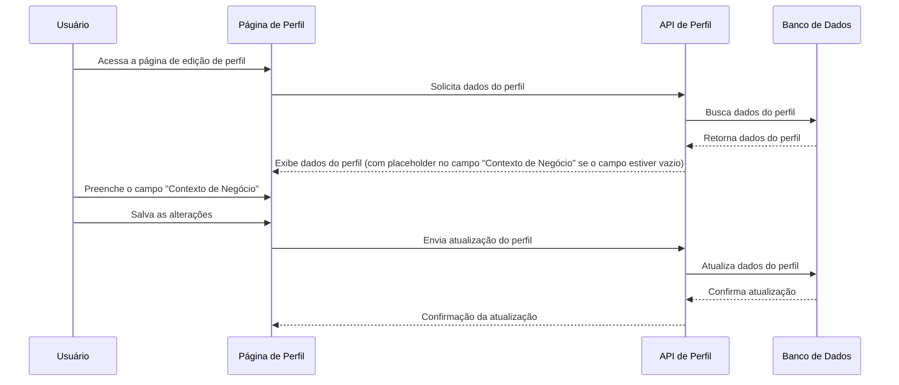

# PBI: Adicionar Placeholder no Campo "Contexto de Negócio" na Edição de Perfil
- **ID da Task:** FEAT-678
- **Título:** Como um usuário, eu quero ver um placeholder no campo "Contexto de Negócio" na tela de edição de perfil, para que eu entenda o tipo de informação esperada nesse campo.
- **Projeto:** App React

## 1. Visão Geral da Feature
Esta funcionalidade visa melhorar a usabilidade da tela de edição de perfil, adicionando um placeholder no campo "Contexto de Negócio" (presumindo que o campo "Biografia" na imagem corresponde a "Contexto de Negócio"). O placeholder guiará o usuário sobre o tipo de informação que deve ser inserida nesse campo, evitando entradas incorretas e melhorando a qualidade dos dados. Isso impacta diretamente na experiência do usuário e na completude das informações de perfil.

### 1.1. User Story
**Como um** usuário,
**Eu quero** ver um placeholder descritivo no campo "Contexto de Negócio" ao editar meu perfil,
**Para que** eu entenda o tipo de informação que devo inserir e preencha o campo corretamente.

## 2. Detalhes Técnicos do Endpoint (se aplicável)
Não aplicável

## 3. Critérios de Aceite
| Dado que... (Given) | Quando... (When) | Então... (Then) |
| :--- | :--- | :--- |
| O usuário está na tela de edição de perfil. | O campo "Contexto de Negócio" está vazio. | Um placeholder, como "Ex: Função atual, área de especialização", é exibido dentro do campo. |
| O usuário clica no campo "Contexto de Negócio". | N/A | O placeholder desaparece. |
| O usuário digita no campo "Contexto de Negócio". | N/A | O texto inserido substitui o placeholder. |
| O usuário salva o perfil com o campo "Contexto de Negócio" vazio. | N/A | O campo é salvo como vazio no banco de dados. |

## 4. Diagrama de Fluxo (Sequence Diagram)

