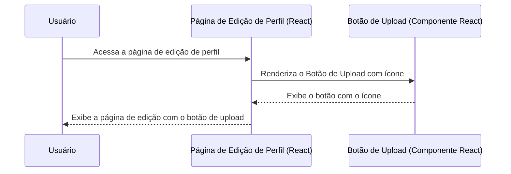

# PBI: Adicionar Ícone ao Botão de Carregar Imagem de Perfil

- **ID da Task:** FEAT-542
- **Título:** Como um usuário, eu quero ver um ícone no botão de carregar imagem de perfil, para que eu possa identificar rapidamente a ação de upload e melhorar a usabilidade.
- **Projeto:** App React (inferido do contexto de Front-End)

## 1. Visão Geral da Feature
Essa funcionalidade visa melhorar a usabilidade da tela de edição de perfil, adicionando um ícone ao botão de upload da imagem de perfil. Isso tornará a ação mais intuitiva e facilmente identificável para o usuário, além de melhorar a aparência da interface. A modificação será realizada no componente responsável pelo upload da imagem.

### 1.1. User Story
**Como um** usuário,
**Eu quero** visualizar um ícone no botão de upload da imagem de perfil,
**Para que** eu possa rapidamente identificar a ação de carregar uma nova imagem.

## 2. Detalhes Técnicos do Endpoint (se aplicável)
Não aplicável

## 3. Critérios de Aceite
| Dado que... (Given) | Quando... (When) | Então... (Then) |
| :--- | :--- | :--- |
| O usuário está na tela de edição de perfil. | O usuário visualiza o botão de upload da imagem de perfil. | O botão de upload exibe um ícone representativo (ex: "upload", "imagem", "camera"). |
| O usuário está na tela de edição de perfil. | O usuário interage com a tela em diferentes resoluções. | O ícone no botão de upload deve manter a proporção e visibilidade em diferentes dispositivos e tamanhos de tela. |
| O usuário tenta fazer upload de uma imagem que não atende aos requisitos (ex: tamanho superior a 5MB, formato inválido). | O usuário clica no botão para carregar uma imagem. | Uma mensagem de erro apropriada é exibida ao usuário, informando o motivo da falha e como corrigi-la. |

## 4. Diagrama de Fluxo (Sequence Diagram)

