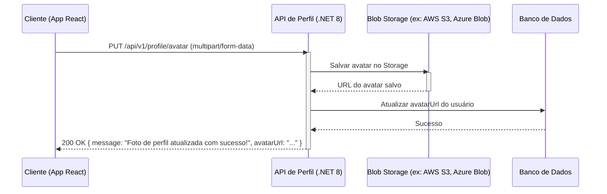

# PBI: Implementar funcionalidade de atualização de foto de perfil

- **ID da Task:** FEAT-852
- **Título:** Como um usuário autenticado, eu quero atualizar minha foto de perfil, para que meu perfil esteja sempre atualizado e represente quem eu sou.
- **Projeto:** App React (assumindo front-end) e API .NET 8 (assumindo back-end)

## 1. Visão Geral da Feature

Essa funcionalidade permite que os usuários atualizem sua foto de perfil. Isso melhora a experiência do usuário, permitindo a personalização e identificação no sistema.  A imagem deve ser carregada pelo usuário e persistida em um storage.

### 1.1. User Story
**Como um** usuário autenticado,
**Eu quero** atualizar minha foto de perfil,
**Para que** meu perfil esteja sempre atualizado e represente quem eu sou.

## 2. Detalhes Técnicos do Endpoint
- **Verbo HTTP:** PUT
- **URL:** /api/v1/profile/avatar
- **Autenticação:** Obrigatória (Bearer Token)
- **Content-Type:** multipart/form-data

### 2.1. Exemplo de Request

```
--BoundaryExample
Content-Disposition: form-data; name="avatar"; filename="profile.jpg"
Content-Type: image/jpeg

[Binary data of the image]

--BoundaryExample--
```

### 2.2. Regras de Validação

- **avatar:** Arquivo. Obrigatório. Formatos JPG ou PNG. Tamanho máximo de 5MB.

### 2.3. Exemplo de Respostas
- **Sucesso (200 OK):**
```json
{
  "message": "Foto de perfil atualizada com sucesso!",
  "avatarUrl": "https://storage.example.com/avatars/user123/profile.jpg"
}
```
- **Erro de Validação (400 Bad Request):**
```json
{
  "errors": {
    "avatar": [
      "O arquivo deve ser do tipo JPG ou PNG.",
      "O arquivo deve ter no máximo 5MB."
    ]
  }
}
```
- **Não Autorizado (401 Unauthorized):**
```json
{
  "message": "Não autorizado"
}
```

## 3. Critérios de Aceite

| Dado que... (Given) | Quando... (When) | Então... (Then) |
| :--- | :--- | :--- |
| O usuário está autenticado | O usuário carrega uma imagem JPG válida com menos de 5MB | A foto de perfil do usuário é atualizada e a nova URL é retornada |
| O usuário está autenticado | O usuário carrega uma imagem PNG válida com menos de 5MB | A foto de perfil do usuário é atualizada e a nova URL é retornada |
| O usuário está autenticado | O usuário tenta carregar um arquivo que não é JPG ou PNG | Uma mensagem de erro informando que o arquivo deve ser JPG ou PNG é exibida |
| O usuário está autenticado | O usuário tenta carregar um arquivo maior que 5MB | Uma mensagem de erro informando que o arquivo excede o tamanho máximo é exibida |
| O usuário não está autenticado | O usuário tenta atualizar a foto de perfil | Uma mensagem de erro 401 (Não autorizado) é retornada |

## 4. Diagrama de Fluxo (Sequence Diagram)

